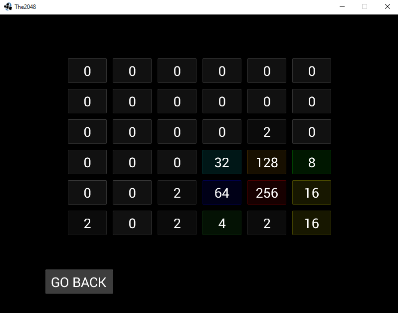
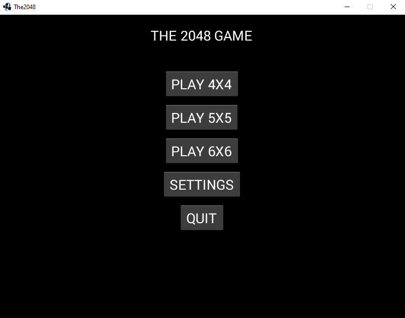
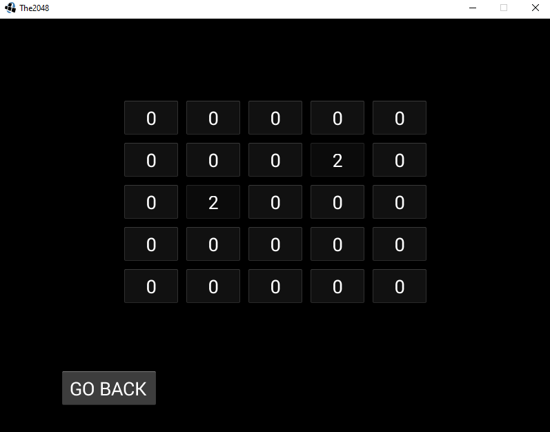

# About The Project
The 2048 game recreated in libGDX.  
Use WASD keys or the arrow keys to make a move.  
This project uses my own libgdx extension: <a href="https://github.com/oziris78/toria-gdx">toria-gdx</a>

# Images

 

 

